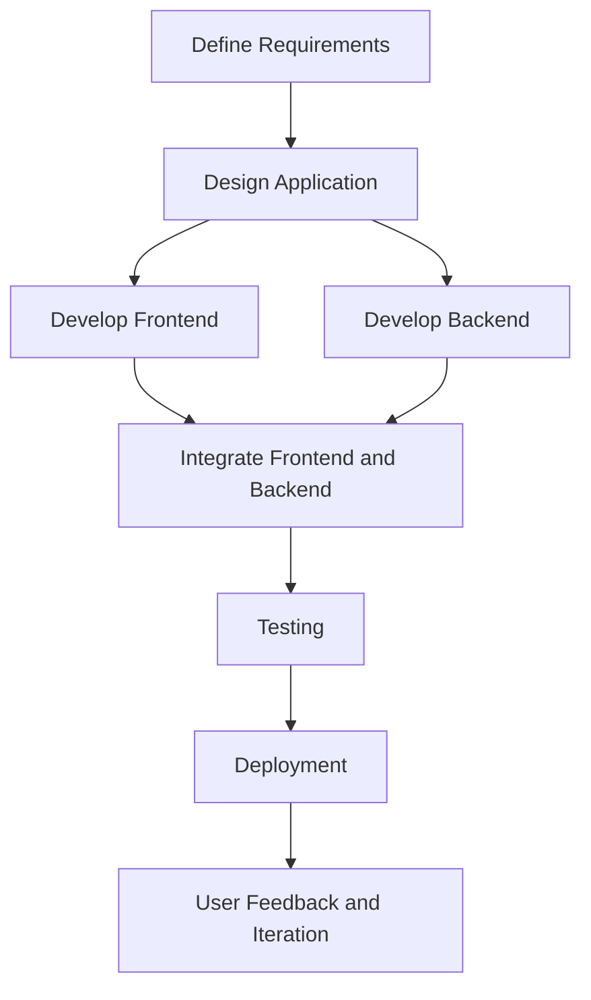

# Schedule Network Diagram

**Generated by Requirements Gathering Agent v2.0.0**  
**Category:** planning-artifacts  
**Generated:** 2025-06-03T10:21:46.639Z  
**Description:** PMBOK Schedule Network Diagram

---

To create a Schedule Network Diagram for the Community Forum App project using Mermaid syntax, we will first identify the key tasks involved in the project. Below are the tasks along with their dependencies that will be represented in the diagram:

### Tasks and Dependencies
1. **Define Requirements** (Task A)
2. **Design Application** (Task B) - Depends on Task A
3. **Develop Frontend** (Task C) - Depends on Task B
4. **Develop Backend** (Task D) - Depends on Task B
5. **Integrate Frontend and Backend** (Task E) - Depends on Tasks C and D
6. **Testing** (Task F) - Depends on Task E
7. **Deployment** (Task G) - Depends on Task F
8. **User Feedback and Iteration** (Task H) - Depends on Task G

### Mermaid Syntax for Network Diagram
Here is the Mermaid syntax to represent the Schedule Network Diagram:

### Explanation of the Diagram
- **A** starts the process by defining the requirements for the application.
- Upon completion of A, **B** (Design Application) can begin.
- Once the design is complete, the development phase splits into two parallel tasks: **C** (Develop Frontend) and **D** (Develop Backend).
- Both development tasks must be completed before moving on to **E** (Integrate Frontend and Backend).
- Once integration is successful, the project moves to **F** (Testing).
- After testing, the application is ready for **G** (Deployment).
- Finally, after deployment, the project enters the **H** (User Feedback and Iteration) phase for improvements based on user input.

### Usage
To visualize this diagram, use a Markdown editor that supports Mermaid syntax. Just copy and paste the code above into the editor to generate the Schedule Network Diagram for the Community Forum App project.